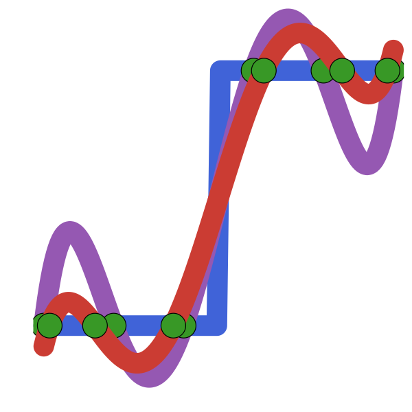
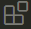

::: {.casc-hero}
::: {.casc-hero-inner}
::: {.casc-hero-content}
# Pratique du calcul scientifique

::: {.casc-hero-subtitle}
Cours de l'**École Nationale des Ponts et Chaussées** — Julia, interpolation, intégration, systèmes linéaires, équations différentielles…
:::

::: {.casc-hero-buttons}
[ Voir les cours](cours.qmd){.casc-btn .casc-btn-primary}
[ Notebooks](notebooks.qmd){.casc-btn .casc-btn-ghost}
[ Polycopié](poly.qmd){.casc-btn .casc-btn-ghost}
:::
:::

::: {.casc-hero-logos}
{.casc-hero-logo-enpc}

{.casc-hero-logo-course}
:::
:::
:::

## [Installations préalables]{.casc-section-title}

Avant de commencer, installez les outils suivants sur votre machine.

::: {.grid}

::: {.g-col-12 .g-col-md-4}
::: {.casc-card}
[]{.casc-card-icon}

### Jupyter

Deux options pour installer Jupyter :

- [Anaconda](https://www.anaconda.com/download) — distribution Python complète intégrant Jupyter
- [Jupyter](https://jupyter.org/install) seul

:::
:::

::: {.g-col-12 .g-col-md-4}
::: {.casc-card}
[]{.casc-card-icon}

### Julia

Téléchargez la dernière version officielle depuis le [site de Julia](https://julialang.org/downloads). Le langage est rapide, expressif et conçu pour le calcul scientifique.
:::
:::

::: {.g-col-12 .g-col-md-4}
::: {.casc-card}
[]{.casc-card-icon}

### VSCode

Installez [VSCode](https://code.visualstudio.com/) puis l'[extension Julia](https://marketplace.visualstudio.com/items?itemName=julialang.language-julia) (icône {height=18px} dans VSCode).
:::
:::

:::

## [Équipe enseignante]{.casc-section-title}

::: {.grid}

::: {.g-col-12 .g-col-md-6}
::: {.casc-card}
[]{.casc-card-icon}

### Groupe 1

[Jean-François Barthélémy](https://jfbarthelemy.github.io/)

[ jean-francois.barthelemy@cerema.fr](mailto:jean-francois.barthelemy@cerema.fr)
:::
:::

::: {.g-col-12 .g-col-md-6}
::: {.casc-card}
[]{.casc-card-icon}

### Groupe 2

[Urbain Vaes](https://urbain.vaes.uk/)

[ urbain.vaes@inria.fr](mailto:urbain.vaes@inria.fr)
:::
:::

:::

::: {.casc-info-banner}


Pour toute question par courriel concernant le cours, merci de contacter **votre chargé de cours**.
:::
